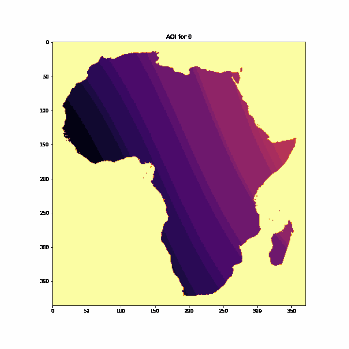

# Irradiance in Africa

Last year project for the "Advanced AI" course at CentraleSupélec (Paris-Saclay University)

## Gallery

Some data visualization results to better understand the data and project:

### Angle of incidence over one day (January 1st)

### Irradiance over a day (January 1st)

